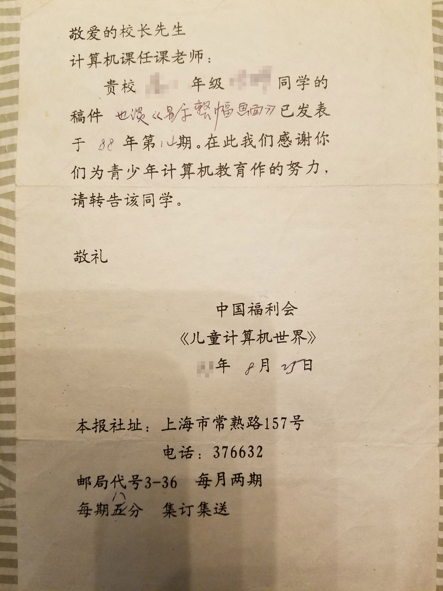

# Hard Disk Protection Card / 硬盘保护卡

This project was developed in the 1990s using assembly language.  
It was my very first project combining both hardware and software.  

这是我90年代开发的第一个软硬件结合项目。  
目的是保护共用机房计算机的操作系统和已安装软件，不被人为篡改或病毒破坏。

The purpose was to protect the operating systems and installed software in shared computer labs from being tampered with by users or damaged by viruses.

At its core, it was an ISA bus expansion card installed directly into the computer to prevent unauthorized modifications at the hardware level.  
The hardware consisted of an EPROM, DRAM, and decoding circuits. It automatically loaded its program during system startup, requiring no external media.

项目核心是一个 ISA 总线扩展卡，通过硬件方式安装到计算机，避免人为篡改。  
硬件由 EPROM、DRAM 和译码电路组成，计算机开机时自动加载程序，无需任何介质。

This project operated under both Chinese and English versions of DOS and the early Windows systems, greatly reducing maintenance work in shared computer environments.

该项目可在中英文 DOS 及 Windows 初期系统下运行，大大减少了共用机房的维护工作。

Dedicated to the passionate and inspiring spirit of the 1990s.

谨以此项目纪念激情澎湃的90年代。

